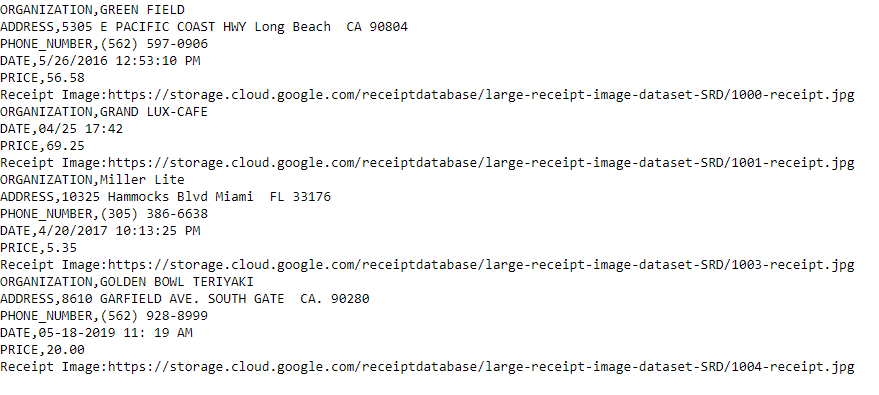

# Receipt Digitization and Parsing With GCP Computer Vision and Natural Language APIs

**Gautham Kishore**  
**7/15/20**  
**Grade 10**


 ## **Problem Statement**

Currently, in countless businesses worldwide, the processing and accounting of receipts is a laborious and mundane task completed by hand over several days of toiling work. This process is also completely manual and due to its very repetitive nature, is quite tedious and erroneous as well. However, with the rise of deep learning, I aim to see if the process of receipt digitization can be optimized using state of the art techniques.  

My goal is to investigate if it is possible to automatically extract key information from receipts including but not limited to (merchant, date of purchase, price, etc), and output this information in a spreadsheet.

Some constraints include the quality of the images provided, as well as the limitations of current open-source implementations of OCR, and other relevant parts of the pipeline that will be described in the next section.


##           Approach: Using OCR and Natural Language Processing

   


```python
APIKEY = 'nice try'
```


```python
!pip install --upgrade pip
!pip install --upgrade google-api-python-client
```

    Requirement already up-to-date: pip in /opt/conda/lib/python3.7/site-packages (20.1.1)
    Requirement already up-to-date: google-api-python-client in /opt/conda/lib/python3.7/site-packages (1.10.0)
    Requirement already satisfied, skipping upgrade: httplib2<1dev,>=0.9.2 in /opt/conda/lib/python3.7/site-packages (from google-api-python-client) (0.18.1)
    Requirement already satisfied, skipping upgrade: uritemplate<4dev,>=3.0.0 in /opt/conda/lib/python3.7/site-packages (from google-api-python-client) (3.0.1)
    Requirement already satisfied, skipping upgrade: google-api-core<2dev,>=1.18.0 in /opt/conda/lib/python3.7/site-packages (from google-api-python-client) (1.21.0)
    Requirement already satisfied, skipping upgrade: google-auth-httplib2>=0.0.3 in /opt/conda/lib/python3.7/site-packages (from google-api-python-client) (0.0.3)
    Requirement already satisfied, skipping upgrade: google-auth>=1.16.0 in /opt/conda/lib/python3.7/site-packages (from google-api-python-client) (1.18.0)
    Requirement already satisfied, skipping upgrade: six<2dev,>=1.6.1 in /opt/conda/lib/python3.7/site-packages (from google-api-python-client) (1.15.0)
    Requirement already satisfied, skipping upgrade: protobuf>=3.12.0 in /opt/conda/lib/python3.7/site-packages (from google-api-core<2dev,>=1.18.0->google-api-python-client) (3.12.3)
    Requirement already satisfied, skipping upgrade: setuptools>=34.0.0 in /opt/conda/lib/python3.7/site-packages (from google-api-core<2dev,>=1.18.0->google-api-python-client) (47.3.1.post20200616)
    Requirement already satisfied, skipping upgrade: requests<3.0.0dev,>=2.18.0 in /opt/conda/lib/python3.7/site-packages (from google-api-core<2dev,>=1.18.0->google-api-python-client) (2.24.0)
    Requirement already satisfied, skipping upgrade: googleapis-common-protos<2.0dev,>=1.6.0 in /opt/conda/lib/python3.7/site-packages (from google-api-core<2dev,>=1.18.0->google-api-python-client) (1.51.0)
    Requirement already satisfied, skipping upgrade: pytz in /opt/conda/lib/python3.7/site-packages (from google-api-core<2dev,>=1.18.0->google-api-python-client) (2020.1)
    Requirement already satisfied, skipping upgrade: rsa<5,>=3.1.4; python_version >= "3" in /opt/conda/lib/python3.7/site-packages (from google-auth>=1.16.0->google-api-python-client) (4.6)
    Requirement already satisfied, skipping upgrade: pyasn1-modules>=0.2.1 in /opt/conda/lib/python3.7/site-packages (from google-auth>=1.16.0->google-api-python-client) (0.2.8)
    Requirement already satisfied, skipping upgrade: cachetools<5.0,>=2.0.0 in /opt/conda/lib/python3.7/site-packages (from google-auth>=1.16.0->google-api-python-client) (4.1.1)
    Requirement already satisfied, skipping upgrade: idna<3,>=2.5 in /opt/conda/lib/python3.7/site-packages (from requests<3.0.0dev,>=2.18.0->google-api-core<2dev,>=1.18.0->google-api-python-client) (2.10)
    Requirement already satisfied, skipping upgrade: certifi>=2017.4.17 in /opt/conda/lib/python3.7/site-packages (from requests<3.0.0dev,>=2.18.0->google-api-core<2dev,>=1.18.0->google-api-python-client) (2020.6.20)
    Requirement already satisfied, skipping upgrade: chardet<4,>=3.0.2 in /opt/conda/lib/python3.7/site-packages (from requests<3.0.0dev,>=2.18.0->google-api-core<2dev,>=1.18.0->google-api-python-client) (3.0.4)
    Requirement already satisfied, skipping upgrade: urllib3!=1.25.0,!=1.25.1,<1.26,>=1.21.1 in /opt/conda/lib/python3.7/site-packages (from requests<3.0.0dev,>=2.18.0->google-api-core<2dev,>=1.18.0->google-api-python-client) (1.25.9)
    Requirement already satisfied, skipping upgrade: pyasn1>=0.1.3 in /opt/conda/lib/python3.7/site-packages (from rsa<5,>=3.1.4; python_version >= "3"->google-auth>=1.16.0->google-api-python-client) (0.4.8)


## Use OCR to Decipher Text from Image

The first part of the pipeline will be OCR, or optical character recognition, in order to separate text from the rest of the image.OCR is the electronic or mechanical conversion of images of typed, handwritten, or printed text into machine-encoded text. This is key in order to get easier to work with text, rather than working with just grayscale values of pixels. The output of the OCR system will be raw text that can be used as the input for a separate model that can harness the natural language processing toolkit. To do this, I will be using the **Google Cloud Vision API** (link in the sources section), by inputting the image URI from cloud storage, in addition to the APIKEY and some settings, in a JSON request to the Google backend, and it returns a large string with the detected text from the image.  


```python
from googleapiclient.discovery import build
import base64

def OCR(IMAGE):
    """
    Extracting all text from image

    Args:
      IMAGE : Cloud Storage URI
    """
    vservice = build('vision', 'v1', developerKey=APIKEY)
    request = vservice.images().annotate(body={
        'requests': [{
           'image': {
              'source': {
                 'gcs_image_uri': IMAGE
          }
      },
          'features': [{
              'type': 'TEXT_DETECTION',
              'maxResults': 3,
        }]
     }],
  })
    responses = request.execute()
    return(responses['responses'][0]['textAnnotations'][0]['description'])
    

```


```python
#EXAMPLE OF OCR WORKING

img = 'gs://receipt2/03wholefoods2-jumbo.jpg'
ocrExampleText = OCR(img)
print(ocrExampleText)
```

    WHÖLE
    FOODS,
    MARKET
    Bryant Park BPK
    1095 6th Ave
    New York, NY 10036
    917-728-5700
    BROU BROWN ALE
    BOTTLE DEPOSIT
    DRSCL STRAWBERRIES
    OVF OG LG EGGS
    365 WHL MLK
    NOUSA HONEY YOGHURT
    365 OG ROMAINE BAG
    365 SALTED CORN CHIPS
    POVG WHITE BAGTT
    365 PNBTR BALLS OG
    365 JMBO PAPER TONELS
    365 CHUNKY SALSA
    LACRX GRAPEFRUIT 12PK
    BOTTLE DEPUSIT
    PNLND GRND BEEF 85/15 ILB
    Subtotal:
    $10.99 T
    $0.30
    $3.49 F
    $2.89 F
    $4.09 F
    $2.29 F
    $2.69 F
    $2.79 F
    $3.50 F
    $3.99 F
    $1.69 T
    $2.69 F
    $5.99 FT
    $0.60
    $5.99 F
    $53.98
    $53.98
    $1.66
    $55.64
    13
    Net Sales:
    Tax
    8.88%
    Total:
    Sold Items:
    Paid:
    VISA
    04/02/2019
    MID:001899898
    $55.64
    09:16:42
    TID:
    207946
    


## Before and After: Example


So far so good as the OCR seems to be doing an impeccable job in detecting all the text in the image. Important information such as price, date of purchase, etc. 

## Extract Relevant Entities from Text

As for the processing of the text which was outputted by the OCR, the next step is to extract relevant information from that text such as date of purchase, merchant, total price, etc. To do this, the simplest approach seems to be with the use of the natural language processing tools on the Google Cloud Platform. The tool in particular that I will be using is the Natural Language API, which is available for free for the purposes of this assignment. The Natural Language API is built using LSTM Recurrent Neural Networks using the massive data sets collected by Google through various means. One example of the NL API in work is in Gmail, where it tries to auto-fill our emails, in order to get things done faster. The NL API also has entity analysis, which is the tool that I will be using in order to extract the relevant information as stated earlier in the paragraph. The Entity Analysis tool finds meaning in text, and can categorize text under different categories such as consumer goods, price, date, etc. There are several more useful categorizations that it makes, but these are ones that I found particularily useful for this project


```python
from google.cloud import language_v1
from google.cloud.language_v1 import enums


def lang_analysis(text_content,printLine = True):
    """
    Analyzing Entities in a String

    Args:
      text_content The text content to analyze
    """

    client = language_v1.LanguageServiceClient()
    type_ = enums.Document.Type.PLAIN_TEXT

    language = "en"
    document = {"content": text_content, "type": type_, "language": language}
    encoding_type = enums.EncodingType.UTF8

    response = client.analyze_entities(document, encoding_type=encoding_type)
    output = {}
    prices = []
    numbers = []
    
    # Loop through entitites returned from the API
    for entity in response.entities:
        if(printLine == True):
            print(u"Representative name for the entity: {}".format(entity.name))
        
        # Get entity type, e.g. PERSON, LOCATION, ADDRESS, NUMBER, et al
            print(u"Entity type: {}".format(enums.Entity.Type(entity.type).name))
        output[enums.Entity.Type(entity.type).name] = entity.name
        
        if(enums.Entity.Type(entity.type).name == 'PRICE'):
            prices.append(entity.name)
        
        if(enums.Entity.Type(entity.type).name == 'NUMBER'):
            numbers.append(entity.name)
        
    maxPrice = 0
    
    for price in prices:
        price = price[1:]
        if(float(price) > float(maxPrice)):
            maxPrice = price
    output['PRICE'] = maxPrice
    
    newPrices = []
    
    if(output['PRICE'] == 0):
        
        for number in numbers:
            if('.' in number):
                newPrices.append(number)
        maxPrice = 0.0
        
        for price in newPrices:
            if(float(price) > float(maxPrice)):
                maxPrice = price
                
        output['PRICE'] = maxPrice
        
        
    for price in newPrices:
         if('$' in price):
            price = price[1:]
                
            if(float(price) < 1):
                    newPrices.remove(price)
        
    if('ORGANIZATION' not in output.keys()):
                output['ORGANIZATION'] = text_content.partition('\n')[0]
    
            
        
    return output
```


```python

```


**Here is an example screenshot of the results from running this method**:


## Main Runner (as well as some CSV writing and final processing)

The final methods are the main method, which acts as the runner script, as well as the getRelevantInfo() method which extracts entities which we care about from the text, as well as the writeToCSV() method which outputs the extracted information to a CSV file.


```python
def getRelevantInfo(response,text):
    
    """
    Gets relevant information(as listed in importantInfo dict), and returns dict with said information
    
    Args:
    response : dict of all entities extracted in lang_analysis() method
    
    """
    
    if('ORGANIZATION' not in response.keys()):
                output['ORGANIZATION'] = text.partition('\n')[0]
    
    output = {}
    importantInfo = ['ORGANIZATION','ADDRESS','PHONE_NUMBER','DATE','PRICE']
   
    for info in importantInfo:
        if(info in response.keys()):
            output[info] = response[info]
            
        
    return output
```


```python
def writeToCSV(output,IMAGE):
    """
    Writes relevant information to CSV file as outputted by getRelevantInfo() method as well as link to the original image.

    Args:
    output : List of relevant entities

    """
    for key in output:
            if (isinstance(output[key],str)):
                output[key] = output[key].replace('\n',' ')
                output[key] = output[key].replace(',',' ')
    
    
    with open('test.csv', 'a') as f:
        for key in output.keys():
            f.write("%s,%s\n"%(key,output[key]))
        
        f.write('Receipt Image:' )
        IMAGE = IMAGE.replace('gs://','https://storage.cloud.google.com/')
        f.write(IMAGE)
        f.write('\n')
```


```python
def main(imageList):
    """
    Runner Method

    Args:
      imageList :  list of image URIs from Cloud Storage
      
    """
    
    for image in imageList:
        textFromOCR = OCR(image)
        response = lang_analysis(textFromOCR,printLine = False)
        output = getRelevantInfo(response,textFromOCR)
        writeToCSV(output,image)
        
        
    
   
   
    
```


```python
def getImageList():
    imageList = []
    
    imageList.append('gs://receiptdatabase/large-receipt-image-dataset-SRD/1000-receipt.jpg')
    imageList.append('gs://receiptdatabase/large-receipt-image-dataset-SRD/1001-receipt.jpg')
    imageList.append('gs://receiptdatabase/large-receipt-image-dataset-SRD/1003-receipt.jpg')
    imageList.append('gs://receiptdatabase/large-receipt-image-dataset-SRD/1004-receipt.jpg')
   
    
    return imageList
```


```python
imageList = getImageList()
main(imageList)
```



Screenshot of csv file

## Line-Item Detection

As an extension of the current project, I tried to detect and return line-items on the different receipts. This, however, is a much more difficult problem, as there are several inconsistencies among the different receipts, making line-item detection very difficult. In the following few cells, I will be explaining some attempts that I made, and why they aren't viable solutions.

### Approach 1:

What I tried to do here was after extracting the relevant information, I tried to remove it from the string of all the text and then return the rest of the extracted text, but clearly it was too simple a solution.There was too much nonsense information, such as small numbers from barcodes, etc. so the information extracted wasn't useful either.


```python


def getLineItems(infoDict,text):
    for key in infoDict.keys():
        text = text.replace(infoDict[key],'')
        

    return text
```

### Approach 2:
   
My second attempt was with running the Natural Language API on each individual line of the String output from the OCR() function. My goal with that was to see if the API could identify entities of the "consumer_good" variety in each line, and add that line to a list of "line-items". However, there were 2 fundamental flaws with that approach. First of all, it is a very expensive approach, as there are several API calls in each receipt, which won't scale well with hundreds or even dozens of receipts. Additionally, many of the individual items are shortened forms of the full name(e.g 'drscl strwbres' instead of 'driscoll strawberries') and as such, the API obviously couldn't identify those as consumer goods. This means that not only is this method cost ineffective, it is impossible due to the different shortenings that each store has for different goods.

## Conclusion

The final product that I have created is most effective as a tool that can aid a human in going through several invoices, though it doesn't eliminate the human aspect of this job, as seen with the difficulty of identifying line items in receipts. However, this program is able to go through hundreds of receipt images, and automatically, and accurately get important information such as total price, the merchant, date of purchase, etc. that are most important for accounting and HR needs.

## Sources:

https://nanonets.com/blog/receipt-ocr/?utm_source=reddit&utm_medium=social&utm_campaign=receipt&utm_content=machineslearn

https://nanonets.com/blog/information-extraction-graph-convolutional-networks/

https://cloud.google.com/natural-language

https://nanonets.com/blog/information-extraction-graph-convolutional-networks/

https://cloud.google.com/vision/docs/ocr

